# ***Data-Cleaning In MySQL***

  Demonstrating data cleaning using MySQL using USHouseholdIncome.cvs and USHouseholdIncome_Statistics.cvs.

### ***Project Overview***

  This project will demonstrate the cleaning and exploratory aspects of data analytics. I will import a total of 4 tables. Two of these tables will be edited and the other two tables will be the control tables of the edited tables to use as a reference and a backup if needed. The tables used in this project are ‘USHousholdIncome.csv’ and ‘USHousholdIncome_Statistics.csv’.

  ### ***Data***

  The data used for this project are USHouseholdIncome.cvs and USHouseholdIncome_Statistics.cvs files imported into MySQL.

  ### ***Tools***

MySQL
  - Used to clean data and do a exploratory data analysis.

### ***Goals***

Clean Data:
  - Show an understanding of looking for and correcting errors in the dataset.

## ***Importing Data***

   I importanted a total of 4 tables. Two of these tables will be edited and the other two tables will be the control tables of the edited tables to use as a reference and a backup if needed. The tables used in this project are ‘USHousholdIncome.csv’ and ‘USHousholdIncome_Statistics.csv’.

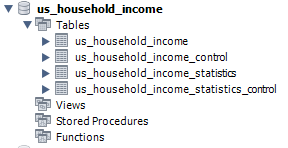

## ***Cleaning Data***

  After importing the tables I noticed that there was an issue with one of the column heads in the ‘Us_Household_Income_Statistics’ table. The first column head was not listed as a usable column in MySQL. This could be due to an import issue caused from formatting in the original data source.

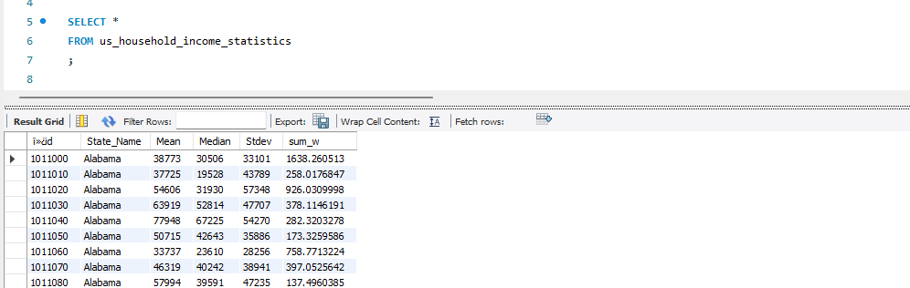

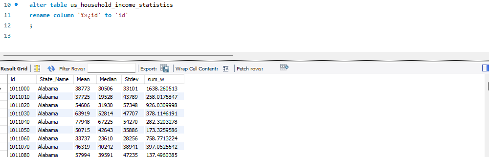

  Next step would be to inspect the data column by column to see if there are any obvious errors in the data. After inspecting the dataset there are a number of areas that have misspelled names and missing data. We can systematically go through each column to ensure that the data is as accurate as possible.

  First before we alter anything, we should check for duplicates. Correcting this may correct some of the work we would start somewhere else. Starting with the ‘Us_Household_Income’ table I check for duplicates using the id column. As shown in the image below there are a number of rows that have duplicates.

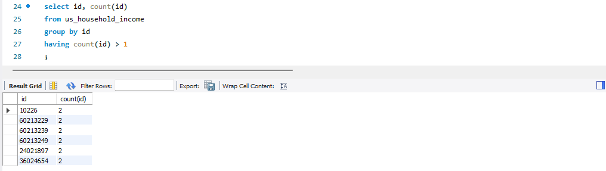

To find the column location I need to query out the ‘row_id’ and ‘id’ using a subquery as shown in the image below to identify the rows that need to be removed.

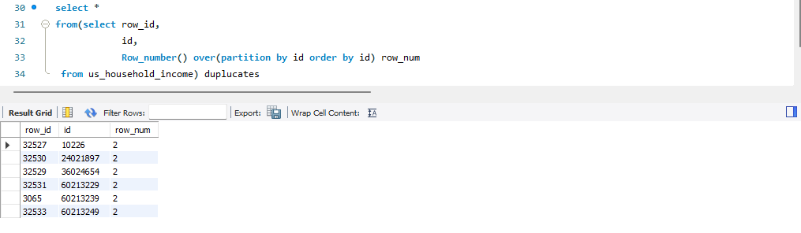

  Next, we can move this query into a delete query to update the dataset as shown in the image below.

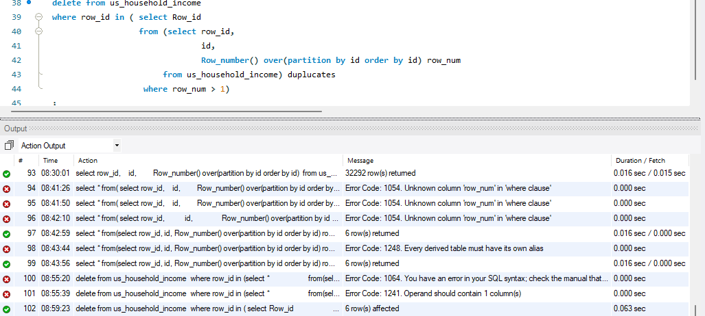

  I then ran through the same process for the other table ‘Us_Household_Income_Statistics’ to clean up any duplicates. According to the results there are no duplicates as shown below.

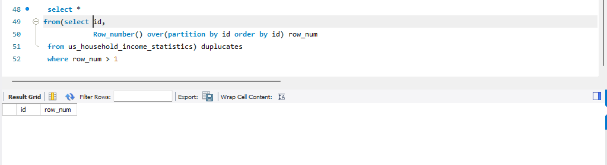

  Going back to the earlier findings of misspelling in the columns, we want to see the extent of the misspelling. When we looked at the ‘State_Name’ column we saw that Alabama was spelled as alabama. We want to do a count similar to what we did earlier to try and identify any more issues with ‘State_Name’. As you will see when queried out MySQL corrects the issue with alabama however we do find an issue with Georgia being misspelled.

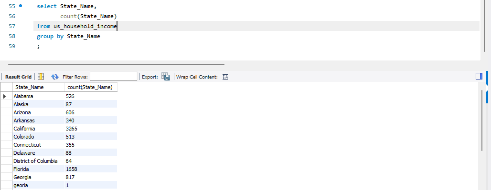

  We want to update the misspelled goriga by running the query shown below to update the column.

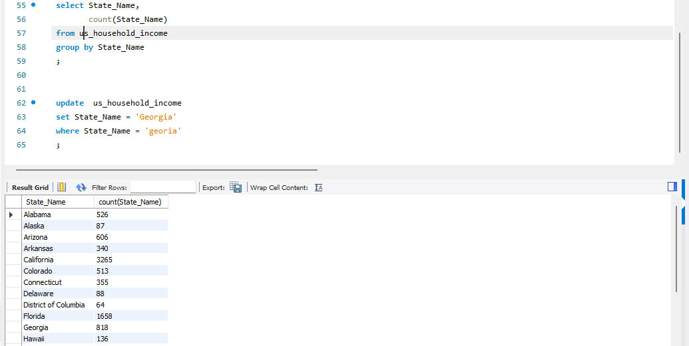

  We can do the same to correct the Alabama spelling form alabama to Alabama.

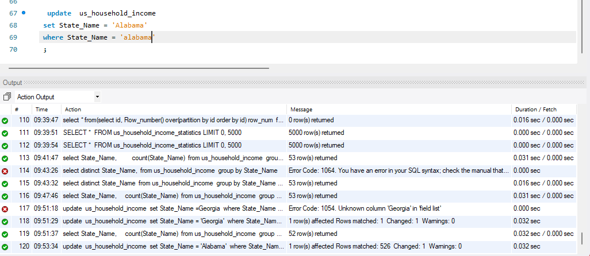

  Another area we found easy was a blank in the ‘Place’ column. To check to see if there are any other blanks in that column, we used the following query and found that there was only one that had a blank cell.

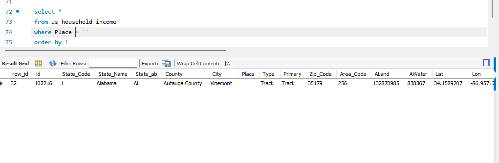

  Looking at the data and running a query on the county the data shows that it was a small error and that the blank should be filled with Autaugaville. This would need to be followed up with a manager or stakeholder to be verified on what to do if any further analysis is needed before correcting. In this case we will fill the blank with Autaugaville as shown below.

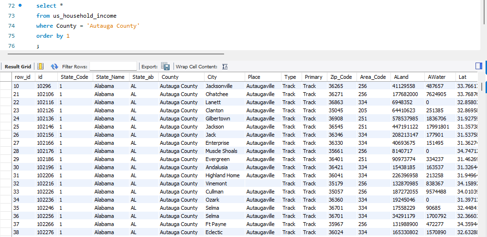

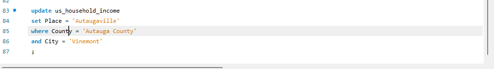

  We want to inspect the ‘Type’ column and we find that there is an issue with spelling. Borough has been spelled two different ways Borough and boroughs. We want to correct this, and we will do so similar to the ways we listed previously.

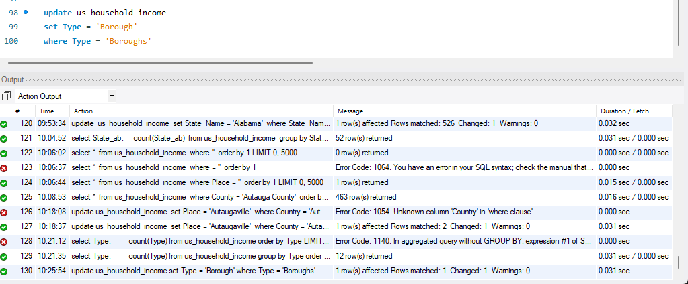

## ***Exploratory Data Analysis***
